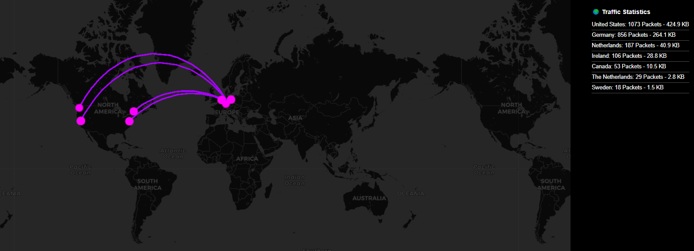

# PacketMonitor

## 📌 Project Overview
This project visualizes **live network traffic** using **Flask, WebSockets, Scapy, and Leaflet.js**. It captures network packets, retrieves geolocation data, and displays them dynamically on a real-time map.

## 🚀 Features
✅ **Live network packet capturing** using Scapy
✅ **Real-time WebSocket communication** between Sniffer & Web UI
✅ **Geolocation mapping** for IP addresses
✅ **Traffic statistics** (connection count & data usage per country)

---

## 🛠 Setup Instructions
### **1️⃣ Clone the Repository**
```sh
git clone https://github.com/kw-soft/PacketMonitor.git
cd PacketMonitor
```

### **2️⃣ Install Dependencies**
```sh
pip install -r requirements.txt
```

### **3️⃣ Install Required Network Capture Tools**
#### **Windows**
Scapy requires **Npcap** to capture packets on Windows. Download and install it from:
- [Npcap Download](https://nmap.org/npcap/)

Make sure to check the option **"Install Npcap in WinPcap API-compatible mode"** during installation.

#### **Linux/macOS**
No additional installation is required, as Scapy uses native network interfaces.
Ensure you have the necessary permissions to capture packets:
```sh
sudo setcap cap_net_raw,cap_net_admin=eip $(which python3)
```

### **4️⃣ Run the WebSocket Server**
```sh
python server.py
```

### **5️⃣ Start Packet Sniffing (if not auto-started)**
```sh
python sniffer.py
```

### **6️⃣ Open the Web UI**
Go to **http://127.0.0.1:8080** in your browser.

---

## 📁 Project Structure
```
/your_project_directory
│── server.py          # Flask WebSocket server with geolocation
│── sniffer.py         # Network sniffer using Scapy
│── requirements.txt   # Python dependencies
│── /templates
│   └── index.html     # Frontend UI
```

---

## 🔧 Configuration
### **Change Network Interface (for Sniffing)**
Edit `sniffer.py` and update the **network interface**:
```python
iface = "Intel(R) I211 Gigabit Network Connection"  # Change to your actual interface
```
Find your interface using:
```sh
ifconfig (Linux/macOS)
ipconfig (Windows)
```

### **API Token for Geolocation (Optional)**
By default, `server.py` uses **ip-api.com** for IP geolocation. To use `ipinfo.io`, update the token:
```python
fetch("https://ipinfo.io/json?token=YOUR_API_TOKEN")
```

---

## 🖥️ Screenshots


---

## 🐜 License
This project is licensed under the **MIT License**.

---

## 👨‍💻 Contributing
Pull requests are welcome! Feel free to fork this repository and submit a PR.

1. **Fork the repo**
2. **Create a new branch** (`feature-xyz`)
3. **Commit your changes** (`git commit -m "Added new feature"`)
4. **Push & create a PR**

---

## 💌 Contact
📧 **Your Email:** kevin@kevsoft.de  
🐙 **GitHub:** [KW-Soft](https://github.com/kw-soft)